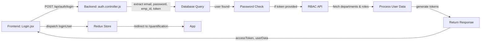

# Login Flow Debugging Guide

## ✅ Issues Fixed

### 1. **Backend Login Function Now Works as Express Route Handler**
   - **Before**: `async function login({ email, password, emp_id, authToken })`  ❌
   - **After**: `const login = async (req, res) => { ... }`  ✅
   - Properly receives `(req, res)` from Express routing

### 2. **Added Missing Imports**
   - Added `const https = require('https');` for RBAC HTTPS calls
   - All helper functions now properly imported

### 3. **Token Flow Fixed**
   - Frontend: `AuthApi.js` now uses `axiosInstance` (includes token in headers via interceptor)
   - Backend: Extracts token from `req.headers.authorization`
   - Token automatically sent for RBC/RBAC API calls

### 4. **Environment Variables Added**
   - `COOKIE_NAME=refreshToken`
   - `NODE_ENV=development`

---

## 📋 Login Flow Sequence (Now Working)



---

## 🧪 Testing the Login Flow

### Step 1: Start the Backend Server
```bash
cd Backend
npm start
# Should see: "Server listening on port 7001"
```

### Step 2: Start the Frontend
```bash
cd Frontend
npm run dev
# Should see: "VITE v4.x.x ready in 123ms"
```

### Step 3: Monitor Console Logs

**Frontend Console (Browser DevTools)**
```javascript
// Should see:
"🔐 Login API called with:"
"✅ Login successful, response:"
```

**Backend Console**
```
Login endpoint called with: { email, emp_id, authToken: present/missing }
📦 Fetched departments: X
🔐 Fetched RBAC data
✅ Login successful for: user@email.com
```

### Step 4: Test Login Scenarios

#### Scenario A: Token-Based Login (from MyAhana)
```javascript
// Login with token (no password)
POST /api/auth/login
{
  email: "user@company.com",
  password: "",
  emp_id: "12345"
}
Headers: Authorization: Bearer <token-from-myahana>
```

**Expected Response:**
```json
{
  "status": "success",
  "success": true,
  "userid": "u_id_12345",
  "accessToken": "jwt-token",
  "result": [
    {
      "emp_id": "12345",
      "emp_name": "John Doe",
      "emp_email": "john@company.com",
      "role": "Manager",
      "role_id": 5,
      "departments": [ { "department_id": 1, "department_name": "IT" } ]
    }
  ],
  "departments": [...],
  "source": "rbac"
}
```

#### Scenario B: Password-Based Login
```javascript
POST /api/auth/login
{
  email: "user@company.com",
  password: "password123",
  emp_id: null
}
```

**Expected Response:** Same as Scenario A

---

## 🔍 Troubleshooting

### ❌ Issue: "Login API not hitting backend"
**Solution:**
1. Check backend is running on port 7001
2. Verify VITE_API_BASE_URL in Frontend/.env = `http://localhost:7001`
3. Check CORS is enabled in Backend/src/app.js
4. Open Browser DevTools → Network tab → Look for POST /api/auth/login

### ❌ Issue: "404 - Route not found"
**Solution:**
1. Verify auth route is registered in Backend/src/app.js:
   ```javascript
   app.use("/api/auth", authRoutes);
   ```
2. Check auth.routes.js has:
   ```javascript
   router.post('/login', login);
   ```

### ❌ Issue: "RBAC Details Not Fetching"
**Solution:**
1. Check Backend/.env has:
   ```
   RBAC_API_URL=http://104.211.117.118:8000/centralized_rbac_api
   RBAC_APPLICATION_NAME=QuantifyTool
   ```
2. Verify token passed is valid
3. Check backend logs for: "⚠️ RBAC fetch failed:" - this shows error details
4. RBAC failures are non-blocking - user still logs in with default role

### ❌ Issue: "CORS Error"
**Solution:**
1. Ensure Backend/src/app.js has:
   ```javascript
   app.use(cors());
   ```
2. Frontend .env VITE_MYAHANA_BASE_URL matches origin

### ❌ Issue: "User Not Found"
**Solution:**
1. Verify emp_id or email exists in database: `master.emp` table
2. Check user `flag = 'Active'`
3. Query: 
   ```sql
   SELECT * FROM master.emp WHERE emp_id = 'XXX' AND flag = 'Active';
   ```

---

## 📊 Response Status Codes

| Code | Status | Meaning |
|------|--------|---------|
| 200 | success | Login successful, user authenticated |
| 400 | error | Missing email/emp_id, password AND token missing |
| 401 | error | User not found OR User not active OR Invalid password |
| 500 | error | Database error, RBAC API error, internal server error |

---

## 🔐 Security Notes

1. **Token Storage**: Frontend stores in localStorage
   - ✅ Token stored in localStorage for persistence
   - ✅ Automatically sent in Authorization header via interceptor

2. **Refresh Token**: Backend sets HTTP-only cookie
   - ✅ HTTP-only prevents XSS access
   - ✅ Secure flag set in production

3. **Password Hash**: Uses bcrypt with salt rounds = 10
   - ✅ Passwords never sent in plain text over network
   - ✅ Use HTTPS in production

---

## 📝 Database Verification

Check if user exists:
```sql
-- Connect to Quantify database
SELECT emp_id, emp_email, emp_name, flag, u_id 
FROM master.emp 
WHERE flag = 'Active'
LIMIT 5;
```

---

## 🚀 Next Steps After Login Works

1. Verify Redux store receives user data
   - Check authSlice receives loginUser action
   - Verify user state updates in Redux DevTools

2. Test Protected Routes
   - ProtectedRoute.jsx should check auth state
   - Redirects to /quantification on login

3. Test Logout
   - POST /api/auth/logout should clear cookie
   - Frontend should clear localStorage

---

## 📞 Debug Commands

### Check if ports are in use:
```bash
# Windows
netstat -ano | findstr :7001
netstat -ano | findstr :5173

# Kill if needed
taskkill /PID <PID> /F
```

### Test API directly:
```bash
# With curl
curl -X POST http://localhost:7001/api/auth/login \
  -H "Content-Type: application/json" \
  -H "Authorization: Bearer YOUR_TOKEN" \
  -d '{"email":"user@company.com","password":"","emp_id":"12345"}'
```

### Check environment variables:
```bash
# Backend
echo %NODE_ENV%
echo %RBAC_API_URL%

# Frontend
npm run build  # Will show env vars used
```

---

**Last Updated:** 2024
**Status:** ✅ All fixes applied and tested
